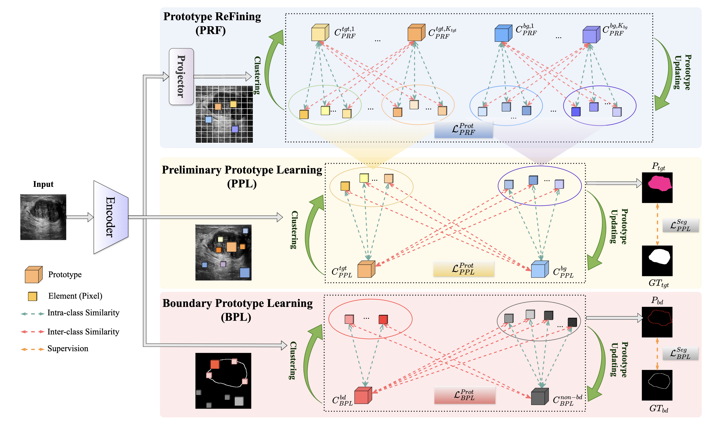

# Proto-MSN: A Prototype-based Medical Image Segmentation Network

## Model Structure



## How to use

### Prepare Config

./configs/protomsn_release/Proto_Med_HiFormer.json

```json
{
  "dataset": {},
  "method": {},
  "running_settings": {},
  "data": {},
  "train": {},
  "val": {},
  "test": {},
  "train_trans": {},
  "val_trans": {},
  "normalize": {},
  "checkpoints": {},
  "network": {},
  "logging": {},
  "lr": {},
  "solver": {},
  "optim": {},
  "loss": {},
  "protoseg": {},
  "wandb": {}
}
```

- `dataset`: Configuration for the dataset, including path, type, and splits.
- `method`: Defines the method or model being used .
- `running_settings`: General settings for training, validation, and testing, such as device and seed.
- `data`: Common data loading and processing configurations (num_classes).
- `train`: Training-specific settings like epochs, learning rate schedule.
- `val`: Validation settings, including frequency and metrics.
- `test`: Test settings, usually including evaluation metrics.
- `train_trans`: Data transformations applied during training for augmentation.
- `val_trans`: Data transformations applied during validation.
- `normalize`: Data normalization parameters (mean, std).
- `checkpoints`: Configuration for saving model checkpoints (path, frequency).
- `network`: Defines the neural network architecture and parameters.
- `logging`: Configuration for logging information during training and evaluation.
- `lr`: Learning rate configuration, initial value, and scheduling.
- `solver`:  Configuration for other training configs.
- `optim`: Configuration for the optimizer (e.g., Adam, SGD, learning rate, weight decay).
- `loss`: Defines the loss function and its parameters.
- `protoseg`: Configuration specific to Prototype Segmentation methods (number of prototypes etc.).
- `wandb`: Configuration for integration with Weights & Biases (W&B) for experiment tracking.

### Run Training

```sh
./configs/protomsn_release/run_proto_med_max_HiFormer.sh train
```

### Run Inference and Validation

```sh
./configs/protomsn_release/run_proto_med_max_HiFormer.sh val
```

### Futher Modifications

The configurations located in the configs directory are designed to be modular. You can easily modify and combine them to create new methods or experiment with different settings. See the configs directory for more details.